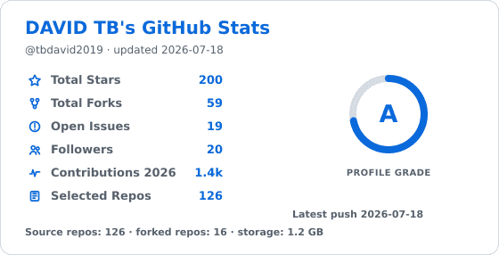
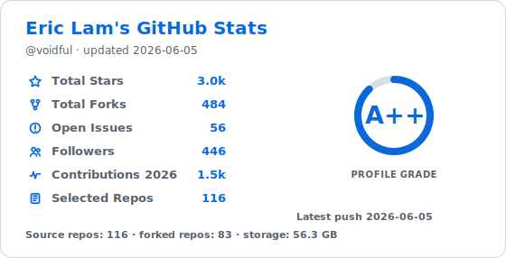
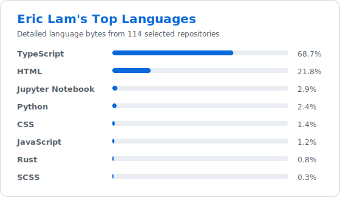
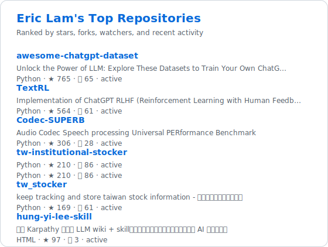

# github-status

`github-status` is a refactored, static GitHub Actions version inspired by GitHub README Stats.
Fork this repository to get your own GitHub profile status cards that update automatically every day.

It does not run a Vercel API and does not accept a `username` query string.
This copy is configured to generate cards for `tbdavid2019`.

When this workflow runs, it generates cards for `tbdavid2019`.

## Demo


```md

```

## Generated files

The workflow writes these files every day:

```text
generated/status.gif
generated/stats.svg
generated/languages.svg
generated/top-repos.svg
generated/stats.json
```

Use them in your README:

```md




```

Use `status.gif` when you want the animated white stats card in a GitHub profile README.

When used from another repository, point the images at your fork:

```md


```

## Manual run

Open the Actions tab and run `Update generated GitHub stats` manually.

## Local run

```bash
export TARGET_LOGIN=tbdavid2019
export GITHUB_TOKEN=your-token
npm ci
npm run generate
```

`GITHUB_TOKEN` can be a fine-grained token or a classic token.
For public-only stats, the repository-scoped token in GitHub Actions is enough.
Private contributions require a user token that has access to those resources.

## Configuration

| Environment variable | Default | Meaning |
|---|---:|---|
| `TARGET_LOGIN` | `tbdavid2019` | Account to fetch. Override it for another account. |
| `OUTPUT_DIR` | `generated` | Output directory. |
| `INCLUDE_FORKS` | `false` | Include forked repositories in repo stats and language stats. |
| `INCLUDE_ARCHIVED` | `true` | Include archived repositories. |
| `MAX_LANGUAGE_REPOS` | `100` | Maximum repositories queried for detailed language bytes. |
| `TOP_LANGUAGE_COUNT` | `8` | Number of languages shown in `languages.svg`. |
| `TOP_REPO_COUNT` | `6` | Number of repositories shown in `top-repos.svg`. |

## Design

The generator reads `TARGET_LOGIN` first. If it is not set, it falls back to the GitHub Actions repository owner and then `tbdavid2019` for local runs.
It avoids `github.actor`, because the actor for scheduled workflows is not the same concept as the repository owner.
The script uses REST for account, repository, and language data.
It uses GraphQL only for the current-year contribution totals of user accounts.
